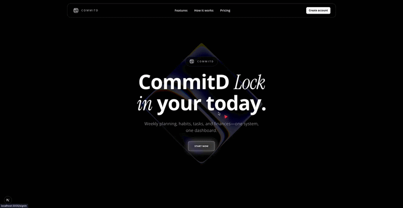
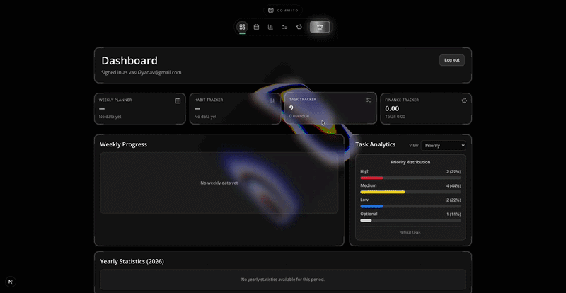
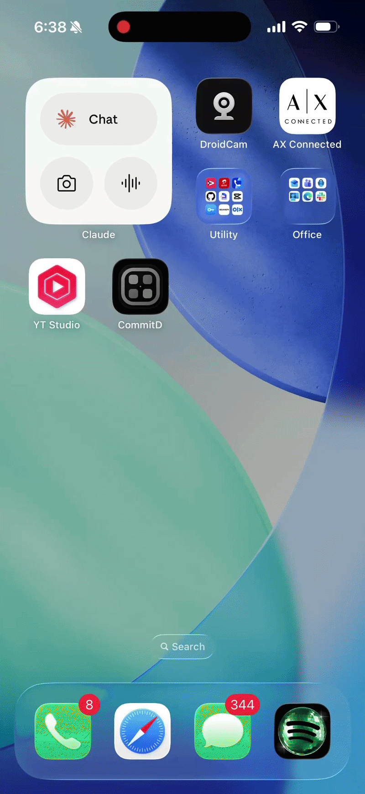

# CommitD

**Weekly planning, habits, tasks, and finances — one system, one dashboard.**

Your productivity tools are scattered across five apps. CommitD brings them into a single dark-themed workspace so you stop context-switching and start executing.

---

## Demo

| Landing Page | Dashboard |
|:---:|:---:|
|  |  |
| Marketing site with animated shader hero | Authenticated workspace with live analytics |

<h4 align="center">Mobile App</h3>

<p align="center">
  
</p>

<p align="center">Capacitor build running on iOS with home screen launch flow.</p>

---

## Features

- **Weekly Planner** — drag-and-drop weekly schedule with time blocks and carry-forward for unfinished items
- **Habit Tracker** — daily habit streaks with monthly heatmap visualization
- **Task Tracker** — priorities (high/medium/low/optional), status tracking, and distribution analytics
- **Finance Tracker** — income streams, recurring expenses, debts, and monthly transaction logging
- **Aggregated Dashboard** — summary cards, weekly progress chart, and task analytics across all modules

All data syncs to Firebase in real-time with debounced writes and flush-on-blur to prevent data loss.

---

## Tech Stack

| Layer | Technology |
|---|---|
| Framework | Next.js 16 (App Router) |
| Language | TypeScript 5 |
| Styling | Tailwind CSS 4 |
| UI | shadcn/ui, Lucide icons |
| Animation | Framer Motion, Paper Design Shaders |
| Charts | Recharts |
| Auth | Firebase Authentication (Email + Google) |
| Database | Cloud Firestore |
| Payments | Razorpay (weekly/monthly subscriptions + lifetime) |

---

## Architecture

Two-app monorepo:

```
commitd/
├── src/                    # Dashboard app (port 3001)
│   ├── app/                # Pages, API routes, protected layout
│   ├── components/         # Auth, paywall, shell, domain widgets
│   ├── hooks/              # Custom React hooks
│   └── lib/                # Firebase, Firestore, entitlement logic
├── landing/                # Landing app (port 3000)
│   └── src/                # Marketing site with shader hero
├── docs/                   # Architecture and deployment docs
└── mobile/                 # Capacitor mobile app
```

**Access control:** Protected routes are wrapped by `RequireAuth`, which checks profile entitlement. Expired access blurs content and shows a blocking paywall. New users get a 24-hour trial automatically on first protected page load.

---

## Quick Start

### 1. Install dependencies

```bash
npm install
npm --prefix landing install
```

### 2. Configure environment

```bash
cp .env.example .env.local
```

Fill in your Firebase and Razorpay credentials. See `.env.example` for all required variables.

### 3. Start both apps

```bash
# Terminal 1 — Dashboard
npm run dev

# Terminal 2 — Landing
npm run dev:landing
```

### 4. Open

- Landing: http://localhost:3000
- Dashboard: http://localhost:3001

---

## Required Services

**Firebase** — create a project with Authentication (Email/Password + Google providers) and Firestore database.

**Razorpay** — create an account and set up subscription plans for weekly and monthly billing. You'll need `RAZORPAY_KEY_ID`, `RAZORPAY_KEY_SECRET`, `RAZORPAY_PLAN_ID_WEEKLY`, and `RAZORPAY_PLAN_ID_MONTHLY`.

---

## Scripts

| Command | Description |
|---|---|
| `npm run dev` | Start dashboard on port 3001 |
| `npm run dev:landing` | Start landing on port 3000 |
| `npm run build` | Build dashboard for production |
| `npm run build:landing` | Build landing for production |
| `npm run lint` | Run ESLint |
| `npx tsc --noEmit` | Type check without emitting |

---

## Building Mobile App

Capacitor commands should be run from the `mobile/` directory because `capacitor.config.ts`, `ios/`, and `android/` live there.

```bash
cd mobile
```

### Sync native projects

Run sync after changing Capacitor config, plugins, web assets, or native assets.

```bash
npx cap sync android
npx cap sync ios
```

The Android sync command copies Capacitor config into `android/app/src/main/assets`. The iOS sync command copies config into `ios/App/App`.

### Open native IDEs

```bash
npx cap open android
npx cap open ios
```

`npx cap open android` opens Android Studio. From there you can run the app on a connected device/emulator, or use the Gradle commands below from `mobile/android`.

`npx cap open ios` opens Xcode. Select the `App` target, choose a simulator or connected device, then click the Build/Run button. For iOS builds, Xcode must have an iOS platform/simulator runtime installed. If Xcode reports `iOS <version> Platform Not Installed`, install it from Xcode Settings > Components or run `xcodebuild -downloadPlatform iOS`.

### Android APK/AAB builds

From `mobile/android`:

```bash
./gradlew assembleDebug
```

Debug APK output:

```text
mobile/android/app/build/outputs/apk/debug/app-debug.apk
```

Install the debug APK on a connected Android device:

```bash
adb install app/build/outputs/apk/debug/app-debug.apk
```

If `adb` is not found, install Android platform tools or use Android Studio's device install flow.

Create a release APK:

```bash
./gradlew assembleRelease
```

Release APK output:

```text
mobile/android/app/build/outputs/apk/release/app-release.apk
```

This may be unsigned unless Android signing is configured.

Create the Play Store bundle:

```bash
./gradlew bundleRelease
```

AAB output:

```text
mobile/android/app/build/outputs/bundle/release/app-release.aab
```

The `.aab` file is for Play Store upload, not direct device install. Use the debug APK for quick local installs.

### Existing mobile scripts

The same common flows are available as npm scripts from the repo root:

| Command | Description |
|---|---|
| `npm --prefix mobile run assets` | Regenerate native iOS and Android icon/splash assets from `mobile/assets/logo.svg` |
| `npm --prefix mobile run sync` | Sync all existing native platforms and regenerate native mobile assets |
| `npm --prefix mobile run sync:android` | Sync Android and regenerate Android assets |
| `npm --prefix mobile run sync:ios` | Sync iOS and regenerate iOS assets |
| `npm --prefix mobile run build:android` | Sync and build an unsigned Android debug APK |
| `npm --prefix mobile run build:android:release` | Sync and build a signed Android release with Capacitor keystore options |
| `npm --prefix mobile run build:ios` | Sync and build the iOS simulator/debug app without a connected device |
| `npm --prefix mobile run build:ios:release` | Sync and archive an iOS release with Xcode signing configured |

## Documentation

- [Architecture](docs/ARCHITECTURE.md) — system design, data model, routing, and access control
- [Docker](docs/DOCKER.md) — containerized deployment

---

## License

MIT
